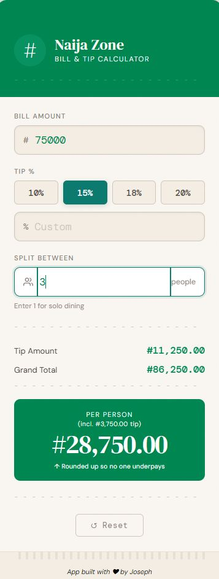

# Naija Zone Bill Split App



A live-updating tip calculator and bill splitter built with React + Vite.

## How to use this Repo

**Prerequisites:** 
Node.js 18+ (check with `node -v`)

```bash
# 1. Clone the repository
git clone https://github.com/comrade70/naija-zone-split-bill-app.git

# 2. Install dependencies
npm install

# 3. Start the dev server
npm run dev

# 4. Open **http://localhost:5173** in your browser.
```

## Production Build

```bash
npm run build    
npm run preview  
```